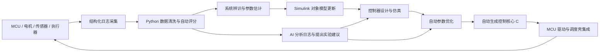

# MCU 控制项目的先进开发模式路线

日期：2026-05-29

## 结论

这不是理论上“能想到的最先进开发模式”。

更准确地说，它是：

- 对当前 MCU 电机/灵巧手控制项目最现实的先进开发模式；
- 单人或小团队能逐步落地的高水平工程路线；
- 从经验主义调参走向模型、数据、代码、验证闭环的正确底座；
- 不是学术前沿和大型工业团队里最激进、最复杂、最高成本的终极形态。

如果按先进性分级：

1. **传统嵌入式控制流**：手写 C、经验调参、实机试错、看波形判断。
2. **现代工程流**：模型驱动开发、自动代码生成、日志回灌、标准测试、实机迭代。
3. **高级工程流**：系统辨识、自动调参、SIL/PIL/HIL、数字孪生、自动回归。
4. **前沿增强流**：AI 辅助实验设计、优化器自动搜索、控制结构搜索、形式化验证、学习型补偿、在线辨识、MPC/RL 等。

当前最建议追求的是第 2 层到第 3 层，并逐步引入第 4 层中可控、可验证、低风险的部分。

一句话概括：

> 这不是绝对最先进的终极方案，但它是当前阶段最先进且可落地的开发模式之一。

---

## 一、为什么不能简单追求“最先进”

控制工程里的“最先进”通常意味着：

- 更复杂的模型；
- 更大的数据量；
- 更强的仿真和验证基础设施；
- 更高的工具链成本；
- 更长的验证周期；
- 更高质量的传感器和执行器；
- 更专业的团队分工；
- 更严格的安全边界和回归验证。

如果在基础闭环没有建立之前直接追求最前沿方案，常见结果不是领先，而是系统失控：

- 模型不可信；
- 数据不可复现；
- 参数优化没有评分依据；
- AI 建议无法验证；
- 自动生成代码无法稳定集成；
- 实机问题无法回灌到模型；
- 每次改动都靠人工判断好坏。

所以正确顺序不是直接上最复杂算法，而是先建立可重复、可验证、可迭代的工程闭环。

---

## 二、推荐的总体架构

目标架构不是“Matlab 生成 C”这么简单，而是形成一个完整闭环：

各模块分工：

| 模块 | 主要职责 |
|---|---|
| MCU | 实时控制、采样、PWM、通信、保护、故障处理 |
| Simulink | 控制器结构、对象模型、仿真工况、代码生成 |
| Matlab | 控制分析、系统辨识、频域/时域验证、参数管理 |
| Python | 日志解析、批量实验、评分函数、优化搜索、报告生成 |
| AI | 日志总结、异常归因、实验建议、参数范围建议、结构候选方案 |
| HIL/SIL/PIL | 自动验证、回归测试、代码一致性检查 |

---

## 三、分层开发模式

### 第 0 层：传统嵌入式开发

典型做法：

- 手写控制代码；
- 手动改 PID；
- 烧录后看波形；
- 出问题靠经验判断；
- 没有标准实验工况；
- 没有自动评分；
- 没有模型回灌。

优点：

- 启动快；
- 工具简单；
- 对小功能很直接。

缺点：

- 难复现；
- 难比较版本；
- 难扩展；
- 难验证；
- 项目复杂后调参成本迅速上升。

这一层不是不能用，但不能作为长期核心开发模式。

---

### 第 1 层：模型驱动开发骨架

目标：

- 用 Simulink 建控制器；
- 控制参数集中管理；
- 自动生成控制核心 C；
- MCU 保留驱动、调度、通信和保护；
- 实机日志可以导入 Matlab/Python 分析；
- 建立基础仿真工况。

关键交付物：

- 控制器 Simulink 模型；
- 参数配置文件；
- 生成代码接口规范；
- MCU 集成壳；
- 日志字段定义；
- 基础测试脚本。

这一层的价值是把开发对象从“代码文件”升级为“控制系统”。

---

### 第 2 层：数据闭环与自动评分

目标：

每次实验后，不再只靠主观观察，而是自动得到量化评分。

典型评分指标：

- 位置跟踪误差 RMS；
- 速度跟踪误差 RMS；
- 超调量；
- 稳态误差；
- 上升时间；
- 调节时间；
- 电流峰值；
- 电流 RMS；
- 饱和次数；
- 限幅触发次数；
- 振荡能量；
- 频域峰值；
- 温升趋势；
- 故障触发次数。

关键交付物：

- 统一日志格式；
- Python 日志解析器；
- 标准评分函数；
- 实验报告自动生成；
- 版本对比表。

没有这一层，AI 和自动优化都缺乏可靠依据。

---

### 第 3 层：系统辨识与自动调参

目标：

用实验数据反推模型和参数，而不是完全依赖人工猜测。

可辨识内容：

- 电机惯量；
- 摩擦参数；
- 刚度；
- 阻尼；
- 延迟；
- 死区；
- 电流环等效模型；
- 速度环等效模型；
- 位置环闭环模型；
- 负载扰动模型。

可自动优化内容：

- PID 参数；
- 前馈增益；
- 滤波器截止频率；
- 限幅参数；
- 加速度/速度规划参数；
- 阻抗控制刚度和阻尼；
- 扰动观测器参数；
- 补偿表参数。

推荐工具：

- Matlab System Identification Toolbox；
- Matlab Optimization Toolbox；
- Python `scipy.optimize`；
- Bayesian Optimization；
- CMA-ES；
- 粒子群；
- 遗传算法。

这一层是从“人工调参”进入“数据驱动调参”的关键跃迁。

---

### 第 4 层：SIL / PIL / HIL / 实机回灌

目标：

每次控制器变更都能自动验证，而不是只靠一次实机试验判断。

验证层级：

| 层级 | 作用 |
|---|---|
| SIL | 验证模型逻辑和生成代码在仿真中的一致性 |
| PIL | 验证生成代码在目标处理器或等效处理器上的行为 |
| HIL | 用真实控制器连接实时仿真对象，验证边界工况 |
| 实机回灌 | 用真实实验数据校正对象模型和评分结果 |

关键交付物：

- 标准测试工况库；
- 自动回归脚本；
- 版本评分记录；
- 失败工况归档；
- 控制器变更报告。

这一层建立后，开发方式会从“试错”变成“工程回归”。

---

### 第 5 层：AI 辅助实验设计

AI 在这里不应该直接替代控制器，而应该嵌入闭环流程。

适合 AI 做的事情：

- 自动阅读实验日志；
- 总结控制性能变化；
- 找出振荡、滞后、饱和、噪声、延迟问题；
- 判断问题更可能来自模型误差、参数不佳还是结构缺陷；
- 推荐下一轮实验；
- 推荐优化变量和搜索范围；
- 生成候选控制结构；
- 对比不同版本的优缺点；
- 辅助生成测试报告。

AI 有效的前提：

- 有结构化日志；
- 有标准评分函数；
- 有统一仿真接口；
- 有可重复实验流程；
- 有自动部署与结果回收；
- 有安全边界和人工确认机制。

没有这些基础，AI 的建议只是“看起来高级”，但无法稳定产生更好的控制器。

---

## 四、比这个更前沿的方向

理论上更先进的路线还包括：

### 1. 非线性 MPC

优点：

- 能显式处理约束；
- 适合多变量耦合系统；
- 可同时考虑性能和安全边界。

难点：

- 计算量大；
- 模型要求高；
- MCU 上实时实现难度高；
- 调试和验证成本高。

### 2. 自适应控制

优点：

- 能适应负载和参数变化；
- 对机械系统长期漂移有价值。

难点：

- 稳定性证明复杂；
- 在线参数更新需要严格约束；
- 实机异常时风险更高。

### 3. 扰动观测器和状态估计器

优点：

- 工程实用性强；
- 对摩擦、负载扰动、外力估计有帮助；
- 比强化学习更可控。

难点：

- 需要较好的模型和噪声处理；
- 参数不当会放大噪声或引入振荡。

### 4. 学习型补偿器

典型形式：

- 摩擦补偿表；
- 齿槽转矩补偿；
- 重复运动误差补偿；
- 神经网络前馈补偿；
- Gaussian Process 补偿。

优点：

- 可以补偿难以精确建模的非线性误差。

难点：

- 必须加安全边界；
- 不应直接替代底层稳定控制器；
- 数据覆盖不足时容易外推失败。

### 5. 强化学习控制

优点：

- 在仿真中可能发现非直观策略；
- 对复杂接触、灵巧操作有潜力。

难点：

- 样本效率低；
- 仿真到现实迁移难；
- 安全验证困难；
- 直接上真实硬件风险高。

对当前项目，不建议第一阶段直接使用强化学习闭环控制。

### 6. 形式化验证

优点：

- 能证明某些安全性质；
- 对高可靠系统非常重要。

难点：

- 建模成本高；
- 覆盖复杂连续控制系统很难；
- 更适合保护逻辑、状态机和安全约束。

### 7. 自动控制结构搜索

目标：

让优化器或 AI 不只调参数，还搜索控制结构。

难点：

- 搜索空间巨大；
- 需要大量仿真和实验；
- 很容易得到不可解释或不可部署的结构。

这一方向很前沿，但不适合作为当前起点。

---

## 五、最先进但可落地的推荐路线

对当前项目，建议采用两阶段路线。

### 第一阶段：建立现代工程骨架

优先级最高的任务：

1. 控制器 Simulink 化；
2. 参数集中管理；
3. 自动生成控制核心 C；
4. MCU 保留驱动、调度、通信、保护；
5. 日志字段标准化；
6. Python/Matlab 一键分析实验日志；
7. 建立基础仿真工况；
8. 建立版本评分表。

完成这一阶段后，项目会从“经验调参”进入“可复现工程迭代”。

### 第二阶段：叠加高级能力

在第一阶段基础上加入：

1. 系统辨识；
2. 自动参数搜索；
3. 标准测试工况库；
4. SIL 回归；
5. 实机数据回灌；
6. AI 辅助日志分析；
7. AI 辅助实验设计；
8. 自动生成对比报告。

完成这一阶段后，项目会接近优秀工业团队的高水平控制开发流程。

### 第三阶段：谨慎引入前沿算法

在验证闭环稳定后，再选择性引入：

1. 扰动观测器；
2. 状态估计器；
3. 学习型前馈补偿；
4. 在线参数估计；
5. 简化 MPC；
6. 形式化安全约束；
7. 高级 AI 实验规划。

原则：

> 前沿算法只能建立在可验证工程闭环之上，不能替代工程闭环。

---

## 六、最终评价

这个开发模式的定位是：

- 比传统 MCU 控制开发先进很多；
- 比单纯 Simulink 生成 C 更完整；
- 比盲目 AI 控制更可靠；
- 比直接上前沿算法更现实；
- 是当前项目通向高级控制研发平台的正确底座。

它不是绝对意义上的“最先进”，因为绝对最先进还会包含大型数字孪生平台、自动实验室、全链路 CI/HIL、形式化验证、控制结构搜索、MPC/RL、在线学习等内容。

但对当前阶段而言，它可以被称为：

> 最先进且现实可落地的 MCU 控制开发模式。

更严格地说：

> 先用模型驱动、日志闭环、自动代码生成和标准验证建立工程底座；再用系统辨识、自动优化和 AI 实验设计持续提升控制性能；最后在安全边界内逐步引入前沿控制算法。
