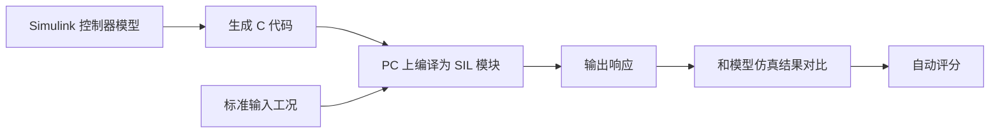
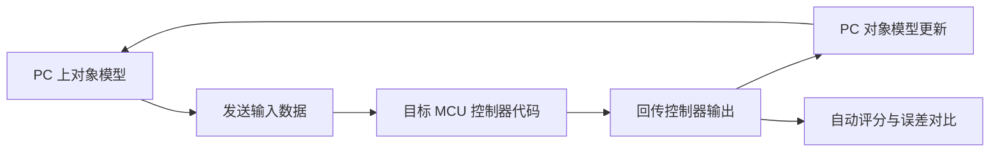
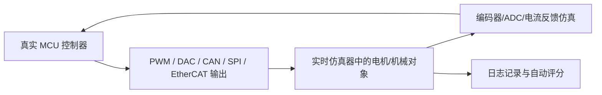
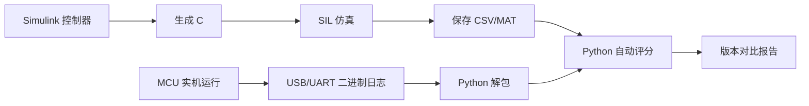

# SIL / PIL / HIL 自动验证实施方案

日期：2026-05-29

## 结论

SIL、PIL、HIL 的核心目的不是“多跑几种仿真”，而是建立一条可重复的验证链：

> 模型控制器是否正确 → 生成 C 代码是否等价 → 目标处理器执行是否一致 → 硬件闭环是否安全可靠 → 实机数据是否能回灌评分。

三者区别：

| 层级 | 全称 | 控制器运行在哪里 | 被控对象运行在哪里 | 主要验证目标 |
|---|---|---|---|---|
| SIL | Software-in-the-Loop | PC 上的生成 C 代码 | Simulink / Python / Matlab 模型 | 验证生成代码和模型逻辑是否一致 |
| PIL | Processor-in-the-Loop | 真实 MCU 或目标处理器 | PC 上的仿真对象模型 | 验证 MCU 上运行的代码数值和时序是否一致 |
| HIL | Hardware-in-the-Loop | 真实控制器硬件 | 实时仿真器或另一块高速控制板 | 验证控制器面对实时对象时是否稳定、安全、可重复 |

推荐落地顺序：

1. 先做 SIL；
2. 再做实机日志回读；
3. 再做简化 PIL；
4. 最后再做 HIL。

对当前 MCU 控制项目，最现实的起步不是马上买昂贵 HIL 平台，而是：

> Simulink SIL + 串口/USB 日志回读 + Python 自动评分 + 简化 PIL/HIL。

---

## 一、SIL 怎么做

### 1. SIL 的目标

SIL 用来回答：

- Simulink 模型里的控制器逻辑是否正确？
- 自动生成的 C 代码和 Simulink 仿真结果是否一致？
- 定点化、采样时间、限幅、状态更新是否有问题？
- 不上板时能不能批量跑测试工况？

SIL 阶段不需要真实 MCU，也不需要通信设备。

### 2. SIL 的基本流程



### 3. SIL 需要的设备

最小配置：

- PC；
- Matlab / Simulink；
- Embedded Coder 或 Simulink Coder；
- C 编译器；
- Python，可选。

不需要：

- MCU；
- JTAG；
- 示波器；
- CAN；
- 串口；
- HIL 平台。

### 4. SIL 验证内容

建议自动验证：

- 阶跃输入响应；
- 正弦输入响应；
- 斜坡输入响应；
- 位置/速度/电流限幅；
- 饱和恢复；
- 零输入漂移；
- 最大最小边界输入；
- NaN/Inf 防护；
- 状态初始化；
- 多采样周期一致性。

### 5. SIL 回读数据

SIL 数据不需要从硬件回读，直接在 PC 端保存：

- Matlab `timeseries`；
- `.mat` 文件；
- `.csv` 文件；
- Python `pandas` 数据表。

建议统一字段：

| 字段 | 含义 |
|---|---|
| `t` | 时间 |
| `ref_pos` | 位置指令 |
| `meas_pos` | 反馈位置 |
| `ref_vel` | 速度指令 |
| `meas_vel` | 反馈速度 |
| `cmd_current` | 电流指令 |
| `actual_current` | 实际电流 |
| `control_out` | 控制器输出 |
| `sat_flag` | 饱和标志 |
| `fault_flag` | 故障标志 |

### 6. SIL 判定标准

可以设置自动通过条件：

- 生成代码输出与模型输出最大误差小于阈值；
- 无 NaN/Inf；
- 无异常状态跳变；
- 限幅逻辑正确；
- 状态更新顺序一致；
- 所有标准工况评分不低于基准版本。

---

## 二、PIL 怎么做

### 1. PIL 的目标

PIL 用来回答：

- 同一份生成 C 代码在目标 MCU 上运行后，结果是否仍和 PC 仿真一致？
- MCU 编译器、浮点库、定点实现是否引入误差？
- 采样周期、函数调用顺序、数据类型是否正确？
- CPU 负载和运行时间是否满足实时性？

PIL 的关键是：

> 控制器在真实 MCU 上跑，对象模型还在 PC 上跑。

### 2. PIL 的基本流程



### 3. PIL 需要的通信设备

常用选择：

| 通信方式 | 适用场景 | 优点 | 缺点 |
|---|---|---|---|
| USB CDC 虚拟串口 | 起步最推荐 | 简单、便宜、易调试 | 带宽和实时性一般 |
| UART + USB 转串口 | 普通 MCU | 成本低、通用 | 需要处理波特率和丢包 |
| JTAG/SWD 调试器 | 调试和内存读取 | 可单步、可看变量 | 不适合高速闭环数据流 |
| CAN / CAN-FD | 多节点电机控制 | 工业常用、抗干扰好 | 需要 CAN 适配器和协议 |
| Ethernet | 高速数据和实时系统 | 带宽高 | MCU 和协议栈要求更高 |
| SPI | 两板高速通信 | 速度高、延迟低 | PC 侧不方便，通常需中间板 |
| XCP on UART/CAN/Ethernet | 标定与测量 | 工业标准化 | 配置复杂 |

当前最建议：

> 第一阶段用 USB CDC 或 UART 回读数据；后续如果多电机或抗干扰要求高，再上 CAN/CAN-FD；如果要高带宽实时 HIL，再考虑 Ethernet 或专用 HIL 接口。

### 3.1 当前计划：USB-TTL 10 ms + EtherCAT-TTL 1 ms

当前准备两套通信链路是合理的，建议明确分工：

| 链路 | 周期 | 定位 | 适合传输内容 | 不适合传输内容 |
|---|---:|---|---|---|
| USB-TTL | 10 ms | 调试、慢速日志、参数下发、实验管理 | 状态字、低频变量、参数、实验命令、摘要日志 | 高频闭环控制、1 kHz 全量波形 |
| EtherCAT-TTL | 1 ms | 实时数据、快速状态回读、PIL/HIL 同步 | 参考量、反馈量、控制输出、状态字、时间戳、实时评分所需变量 | 大量文本日志、非实时调试打印 |

推荐原则：

- USB-TTL 做“工程管理通道”；
- EtherCAT-TTL 做“实时验证通道”；
- 两条链路都使用二进制帧；
- 两条链路都必须带 `seq`、`timestamp_us`、`status` 和校验；
- 不要在实时链路上打印字符串；
- 1 ms 链路只传验证所需的最小变量集。

需要注意：

> EtherCAT 标准物理层本质上是以太网链路，“EtherCAT-TTL”通常意味着中间有 EtherCAT 从站模块、网关板或 TTL 侧接口。设计时要确认它到底是 UART-TTL、SPI-TTL、并口 TTL，还是只把 EtherCAT 过程数据映射到 TTL 引脚。

如果它本质是 EtherCAT 从站网关，PC 侧还需要：

- EtherCAT 主站软件，例如 TwinCAT、SOEM、IgH EtherCAT Master 或 Matlab/Simulink Real-Time 相关接口；
- 支持实时通信的网卡和系统配置；
- 明确 PDO 映射；
- 明确 1 ms 周期下的抖动和丢包统计。

如果它只是 TTL 串口链路，则不能简单按 EtherCAT 的实时性理解，需要按 UART 波特率重新计算带宽。

建议先做一个通信验收测试：

1. 固定 1 ms 发送一帧；
2. 连续运行 10 分钟；
3. 统计 `seq` 是否连续；
4. 统计最大周期、最小周期、平均周期和抖动；
5. 统计 CRC 错误数；
6. 统计 PC 接收时间戳和 MCU 时间戳的偏差；
7. 通过后再把它用于 PIL/HIL。

### 4. PIL 最小硬件配置

最小可行配置：

- 目标 MCU 控制板；
- USB 数据线，或 USB 转串口模块；
- PC；
- Matlab/Simulink；
- Python 日志解析脚本；
- 可选 JTAG/SWD 调试器。

如果是 C2000 类电机控制板，通常还会用到：

- XDS110 / XDS100 / XDS200 调试器；
- UART 或 SCI 串口；
- CAN 收发器，可选；
- Code Composer Studio 工具链；
- Matlab C2000 Support Package。

### 5. PIL 数据怎么回读

推荐做法是定义一个固定二进制数据帧，而不是直接打印文本。

原因：

- 文本日志占带宽；
- 解析慢；
- 时间戳不稳定；
- 容易丢字段。

建议数据帧：

| 字段 | 类型 | 说明 |
|---|---|---|
| `header` | `uint16` | 帧头，例如 `0xAA55` |
| `seq` | `uint32` | 帧序号 |
| `timestamp_us` | `uint32` | MCU 时间戳 |
| `ref_pos` | `float` | 位置指令 |
| `meas_pos` | `float` | 位置反馈 |
| `ref_vel` | `float` | 速度指令 |
| `meas_vel` | `float` | 速度反馈 |
| `cmd_current` | `float` | 电流指令 |
| `actual_current` | `float` | 实际电流 |
| `control_out` | `float` | 控制输出 |
| `status` | `uint32` | 状态位 |
| `crc` | `uint16` | 校验 |

PC 端回读流程：


### 6. PIL 验证指标

PIL 重点关注：

- MCU 输出和 PC 参考输出的最大误差；
- 平均误差；
- 漂移；
- 是否有丢帧；
- 是否有溢出；
- 是否有 NaN/Inf；
- 控制周期是否超时；
- CPU 占用；
- 栈和 RAM 使用量；
- 浮点/定点误差。

通过条件示例：

- 输出误差 RMS 小于设定阈值；
- 最大误差小于安全阈值；
- 丢帧率小于 0.1%；
- 控制周期无超时；
- 状态机无异常跳转；
- 与 SIL 评分相比无明显退化。

---

## 三、HIL 怎么做

### 1. HIL 的目标

HIL 用来回答：

- 真实控制器硬件面对实时对象模型时是否稳定？
- 通信延迟、采样抖动、ADC/PWM 接口是否会导致问题？
- 故障、限位、急停、过流、传感器异常等边界工况是否安全？
- 在不上真实机械负载的情况下，能否批量验证危险工况？

HIL 的关键是：

> 控制器是真硬件，被控对象是实时仿真硬件。

### 2. HIL 的基本流程



### 3. HIL 设备选择

#### 方案 A：低成本简化 HIL

适合当前阶段。

设备：

- 一块目标 MCU 控制板；
- 一块辅助 MCU / 高速开发板作为对象仿真器；
- UART/CAN/SPI/PWM/ADC 接口；
- PC 做数据记录；
- 示波器/逻辑分析仪，可选。

辅助板可选：

- STM32 H7；
- TI C2000；
- Teensy 4.x；
- Raspberry Pi Pico 2/RP2040，低速场景；
- FPGA，小延迟高实时要求场景。

优点：

- 成本低；
- 可控；
- 适合学习和项目早期。

缺点：

- 精度和实时性有限；
- 需要自己写对象模型和接口；
- 不如商业 HIL 可靠。

#### 方案 B：中高端实时 HIL

设备：

- Speedgoat Real-Time Target；
- dSPACE；
- OPAL-RT；
- NI PXI / CompactRIO；
- Typhoon HIL，电力电子方向常用。

优点：

- 实时性强；
- I/O 完整；
- 与 Simulink 集成好；
- 适合自动回归和工业验证。

缺点：

- 成本高；
- 学习曲线高；
- 对当前个人/小团队项目可能过重。

当前建议：

> 先做低成本简化 HIL，等控制架构稳定后再考虑商业 HIL。

### 4. HIL 通信和接口

HIL 不是只有“通信”，还涉及信号级接口。

常见接口：

| 接口 | 用途 |
|---|---|
| PWM | 控制器输出到电机驱动/仿真器 |
| ADC 模拟量 | 仿真器回传电流、电压、传感器信号 |
| 编码器 A/B/Z | 仿真器回传位置 |
| SPI | 高速传感器或板间数据 |
| CAN/CAN-FD | 电机控制命令和状态回读 |
| UART/USB | 调试日志和低速控制 |
| Ethernet | 高速日志、实时仿真或上位机通信 |
| GPIO | 限位、故障、使能、急停 |

对电机控制类项目，关键接口通常是：

- PWM 输出；
- 电流反馈 ADC；
- 编码器反馈；
- 故障输入；
- 使能输出；
- 日志通信口。

### 5. HIL 数据怎么回读

HIL 建议有两路数据：

#### 1）控制器内部日志

从真实 MCU 回读：

- 控制器状态；
- 参考输入；
- 反馈输入；
- 控制输出；
- 限幅状态；
- 故障状态；
- 执行时间。

通信方式：

- UART/USB；
- CAN；
- Ethernet；
- XCP；
- JTAG 低速读取，不推荐作为主日志通道。

#### 2）HIL 对象日志

从实时仿真器回读：

- 仿真对象真实状态；
- 模拟传感器信号；
- 注入扰动；
- 故障注入时间；
- 实时步长是否超时。

最后在 PC 端按时间戳对齐。

建议所有日志都包含：

- 统一实验 ID；
- 版本号；
- 参数哈希；
- 时间戳；
- 帧序号；
- 状态字；
- CRC 或完整性校验。

---

## 四、自动验证怎么做

### 1. 标准测试工况库

应建立一组固定测试，不同控制器版本都跑同一套。

建议工况：

| 工况 | 目的 |
|---|---|
| 零输入保持 | 检查漂移、噪声、积分累积 |
| 小阶跃 | 检查线性区响应 |
| 大阶跃 | 检查限幅和超调 |
| 斜坡跟踪 | 检查速度误差 |
| 正弦扫频 | 估计带宽和共振 |
| 负载扰动 | 检查抗扰能力 |
| 参数摄动 | 检查鲁棒性 |
| 传感器噪声 | 检查滤波和稳定性 |
| 反馈丢包 | 检查异常处理 |
| 限位触发 | 检查安全状态机 |
| 急停 | 检查保护路径 |
| 饱和恢复 | 检查积分抗饱和 |

### 2. 自动评分函数

每个工况输出统一评分：

```text
score = tracking_score
      - overshoot_penalty
      - current_penalty
      - vibration_penalty
      - saturation_penalty
      - fault_penalty
      - timeout_penalty
```

推荐指标：

- `rms_error`：跟踪误差 RMS；
- `max_error`：最大误差；
- `overshoot`：超调量；
- `settling_time`：调节时间；
- `current_rms`：电流 RMS；
- `current_peak`：电流峰值；
- `saturation_count`：饱和次数；
- `fault_count`：故障次数；
- `timeout_count`：控制周期超时次数；
- `lost_frame_rate`：丢帧率；
- `oscillation_energy`：振荡能量。

### 3. 自动判定

每次验证输出：

- PASS；
- WARNING；
- FAIL。

建议判定逻辑：

- 安全故障触发异常：FAIL；
- NaN/Inf：FAIL；
- 控制周期超时：FAIL；
- 电流峰值超过阈值：FAIL；
- 跟踪误差比基准差太多：FAIL；
- 评分略低但安全：WARNING；
- 所有指标达标：PASS。

### 4. 验证报告

自动生成报告应包含：

- 控制器版本；
- 参数版本；
- 代码生成时间；
- Git commit；
- 测试工况列表；
- 每个工况评分；
- 与上一版本对比；
- 波形图；
- 失败原因；
- 是否允许上实机。

---

## 五、推荐的当前落地路线

### 阶段 1：SIL + 日志评分

先完成：

1. Simulink 控制器模型；
2. 自动生成 C；
3. SIL 仿真；
4. 保存 `.mat` 或 `.csv`；
5. Python 自动评分；
6. 版本对比报告。

目标：

> 不上板也能判断控制器改动是否明显变好或变坏。

### 阶段 2：实机日志回读

完成：

1. MCU 固定周期记录关键变量；
2. 通过 USB/UART/CAN 回传；
3. Python 解包；
4. 对齐时间戳；
5. 自动评分；
6. 与 SIL 结果对比。

目标：

> 实机实验不再靠肉眼看波形，而是自动出评分和报告。

### 阶段 3：简化 PIL

完成：

1. PC 发送测试输入序列；
2. MCU 执行控制器一步；
3. MCU 回传输出；
4. PC 对比参考输出；
5. 统计数值误差和执行时间。

目标：

> 验证目标 MCU 上的控制器计算结果和 PC 参考结果一致。

### 阶段 4：低成本 HIL

完成：

1. 辅助 MCU 运行简化电机/机械对象模型；
2. 目标 MCU 运行真实控制器；
3. 两板通过 PWM/ADC/编码器/CAN/SPI 交互；
4. PC 同时记录控制器日志和对象日志；
5. 自动评分。

目标：

> 在不上真实机械负载或降低危险的条件下验证闭环稳定性和保护逻辑。

### 阶段 5：商业 HIL 或实时仿真平台

当项目复杂度和预算允许时，再考虑：

- Speedgoat；
- dSPACE；
- OPAL-RT；
- NI；
- Typhoon HIL。

目标：

> 建立接近工业级的自动回归验证平台。

---

## 六、当前最推荐的设备组合

### 起步组合

适合第一阶段和第二阶段：

- 目标 MCU 控制板；
- USB 数据线或 USB 转串口；
- 可选 JTAG/SWD/XDS 调试器；
- PC；
- Matlab/Simulink；
- Python。

用途：

- SIL；
- 实机日志回读；
- 自动评分；
- 简单 PIL。

### 中级组合

适合简化 HIL：

- 目标 MCU 控制板；
- 辅助 MCU 板；
- CAN 收发器或 SPI 连接；
- 逻辑分析仪；
- 示波器；
- PC 日志系统。

用途：

- 两板闭环；
- 故障注入；
- 实时对象仿真；
- 保护逻辑验证。

### 高级组合

适合工业级 HIL：

- Speedgoat / dSPACE / OPAL-RT / NI / Typhoon HIL；
- 真实控制器硬件；
- I/O 接口板；
- 自动测试脚本；
- CI 服务器，可选。

用途：

- 自动回归；
- 高速实时对象仿真；
- 多通道 I/O；
- 批量测试和报告。

---

## 七、最小可行版本

当前最建议先做这个版本：



最小设备：

- 现有 MCU 板；
- USB 或串口；
- PC；
- Matlab/Simulink；
- Python。

不需要一开始就买商业 HIL。

---

## 八、关键原则

1. 先 SIL，再实机日志，再 PIL，最后 HIL。
2. 先验证数值一致性，再验证实时性，再验证闭环安全。
3. 日志必须结构化，不能只靠串口打印文本。
4. 每个实验必须有版本号、参数号、时间戳和评分。
5. 自动验证必须有 PASS/WARNING/FAIL 结论。
6. AI 只能基于日志和评分提出建议，不能替代安全验证。
7. HIL 的价值是降低实机风险，不是替代最终实机测试。

---

## 九、`Controller_step()` 怎么集成到 MCU

`Controller_step()` 不是运行时“注入”到 MCU，而是在固件工程里编译、链接、烧录进去。

正确理解是：

> Simulink 生成控制核心 C 代码，MCU 工程在固定定时中断里周期调用 `Controller_step()`。

基本集成流程：

1. Simulink 生成 `Controller.c`、`Controller.h` 和相关类型文件；
2. 把这些生成文件加入 MCU 固件工程；
3. MCU 启动时调用一次 `Controller_initialize()`；
4. 在固定周期定时器中断、PWM 中断或实时任务中：
     - 读取传感器；
     - 更新 `Controller_U` 输入结构体；
     - 调用 `Controller_step()`；
     - 读取 `Controller_Y` 输出结构体；
     - 做限幅、安全检查和执行器输出；
5. 停机或复位时可调用 `Controller_terminate()`，多数裸机工程可不使用。

当前生成代码中的输入包括：

| 输入 | 含义 |
|---|---|
| `q_ref` | 位置参考 |
| `q` | 位置反馈 |
| `qdot` | 速度反馈 |
| `qddot` | 加速度反馈或估计值 |
| `tau_prev` | 上一周期力矩/电流等效输出 |
| `mode` | 控制模式 |

当前生成代码中的输出包括：

| 输出 | 含义 |
|---|---|
| `tau_cmd` | 控制器输出力矩命令 |
| `tau_load_hat` | 负载扰动估计 |

### 运行间隔

当前代码的模型步长是 0.001 s，因此 `Controller_step()` 应每 1 ms 调用一次，也就是 1 kHz。

原因：

- 代码内部积分项使用了 `0.001 * e`；
- `Controller_initialize()` 中设置了 `stepSize0 = 0.001`；
- 生成代码注释里也标注了 Sample time 为 `[0.001s, 0.0s]`。

所以当前版本不能随便改成 10 ms 调用。若要 10 ms 运行，必须回到 Simulink 修改采样时间并重新生成代码，否则积分、滤波和 DOB 参数都会不匹配。

推荐调度：

| 任务 | 周期 | 说明 |
|---|---:|---|
| 电流环 / PWM 更新 | 50-100 us 或按硬件能力 | 如果有底层电流环，通常比位置/阻抗环更快 |
| `Controller_step()` | 1 ms | 当前生成控制器主周期 |
| EtherCAT-TTL 实时数据 | 1 ms | 与 `Controller_step()` 对齐 |
| USB-TTL 管理和慢日志 | 10 ms | 参数、状态、摘要日志、实验命令 |
| 慢速状态机/温度/诊断 | 10-100 ms | 非实时任务 |

### 当前代码上板前需要处理的问题

当前文件是 GRT 目标生成的原型代码，不是干净的嵌入式裸机代码。上 MCU 前建议处理：

1. 关闭 Matfile logging；
2. 避免依赖 `rt_logging.h`、`rt_nonfinite.h` 等非必要原型仿真支持文件；
3. 尽量改用 Embedded Coder 或嵌入式目标生成更干净的代码；
4. 把 `real_T` 明确成 MCU 上可接受的 `float` 或 `double`；
5. 如果 MCU 没有硬件双精度浮点，优先改成单精度；
6. 不要把日志打印放在 1 ms 中断内；
7. 在 `Controller_step()` 外层增加输出限幅和故障保护。

推荐结构：

```text
系统启动：
    初始化时钟、GPIO、ADC、PWM、编码器、通信
    调用 Controller_initialize()

1 ms 定时中断：
    读取 q、qdot、qddot、tau_prev、mode、q_ref
    写入 Controller_U
    调用 Controller_step()
    读取 Controller_Y.tau_cmd 和 Controller_Y.tau_load_hat
    做安全限幅
    输出到电流环 / PWM / 执行器命令
    把关键变量放入日志环形缓冲区

10 ms 后台任务：
    USB-TTL 上传慢速日志
    接收参数和实验命令

1 ms 实时通信任务：
    EtherCAT-TTL 上传实时数据帧
    接收实时参考量或 HIL/PIL 输入
```

最终目标：

> 每次控制器改动后，系统能自动完成仿真、代码一致性检查、目标处理器验证、硬件闭环验证和实验报告生成，从而决定是否允许进入真实负载测试。
