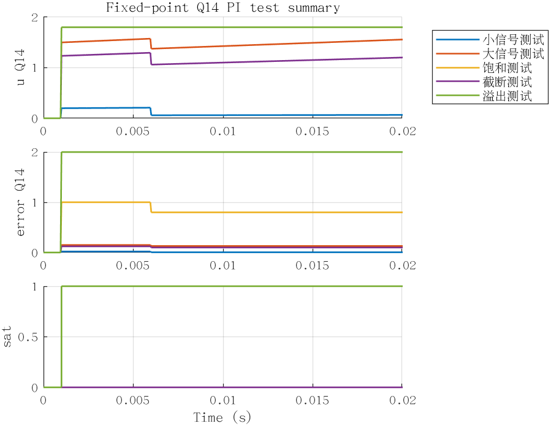
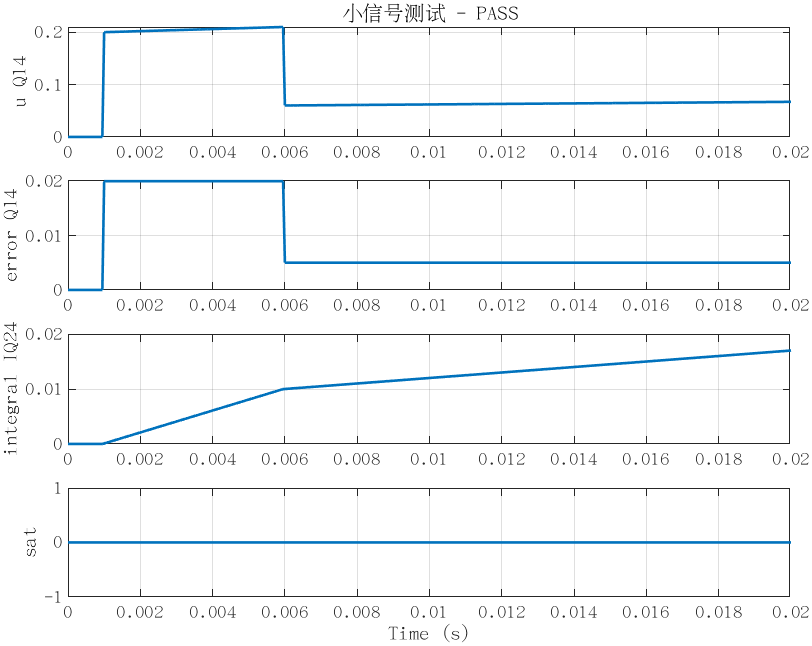
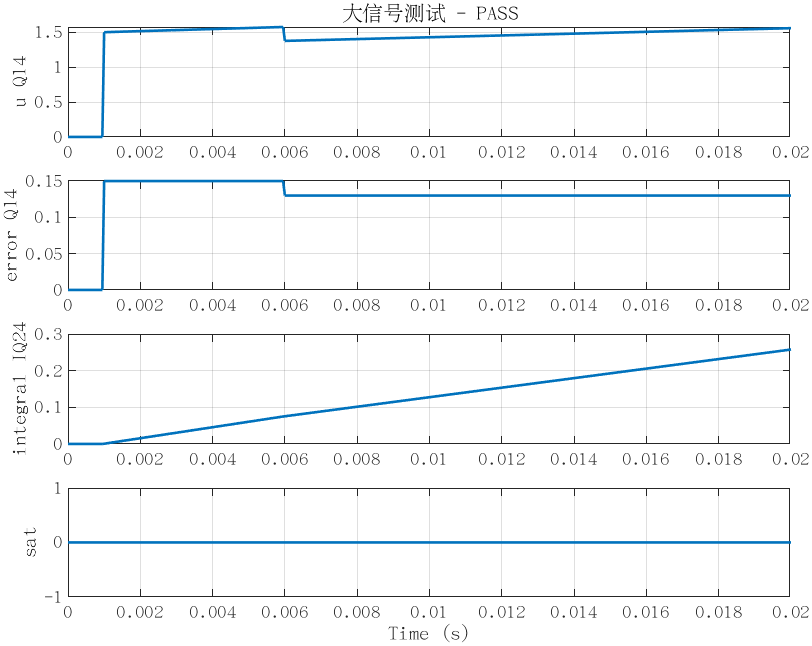
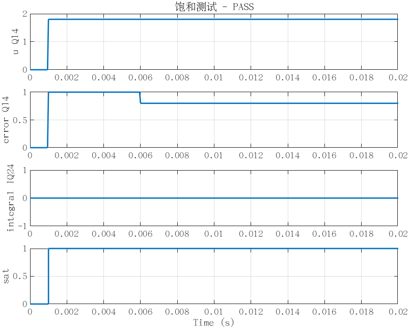
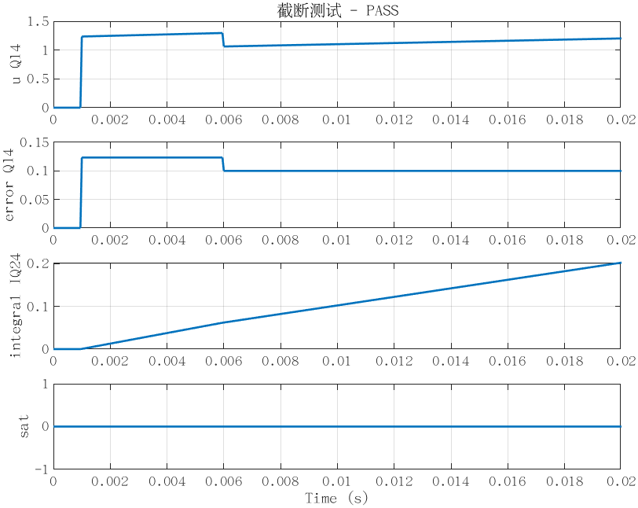
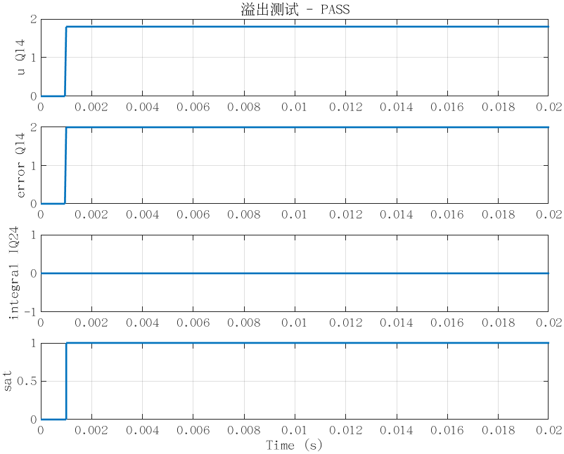

# Fixed-point Q14 PI 测试报告

生成时间：2026-06-02 12:06:09

## 被测对象

- 模型：fixed_point_pi_q14
- 可复用模块：FixedPointPI_Q14
- 输入/输出接口：Q14，`sfix16_En14`
- 积分内部状态：IQ24，`sfix32_En24`
- 增益参数类型：`sfix32_En20`
- Q14 LSB：6.103515625e-05
- IQ24 LSB：5.96046447754e-08
- 输出限幅量化值：上限 1.79998779297，下限 -1.79998779297

## 总览图

## 测试汇总

| 测试 | 结果 | final u | final error | final integral | peak abs u | sat ratio | 误差量化偏差 |
|---|---:|---:|---:|---:|---:|---:|---:|
| 小信号测试 | PASS | 0.06701660 | 0.00500488 | 0.01699561 | 0.20953369 | 0.00 % | 0 |
| 大信号测试 | PASS | 1.55767822 | 0.13000488 | 0.25762945 | 1.57458496 | 0.00 % | 0 |
| 饱和测试 | PASS | 1.79998779 | 0.80004883 | 0.00000000 | 1.79998779 | 95.01 % | 0 |
| 截断测试 | PASS | 1.20190430 | 0.09997559 | 0.20215905 | 1.29577637 | 0.00 % | 0 |
| 溢出测试 | PASS | 1.79998779 | 1.99993896 | 0.00000000 | 1.79998779 | 95.01 % | 0 |

## 详细结果

### 小信号测试

- 说明：小误差闭环输入，验证无饱和时 PI 输出、误差和积分状态正常。
- 输入：ref = 0.02，feedback = 0.015
- 判据：无 NaN/Inf，输出不饱和，最终输出小于 0.2，误差 Q14 量化正确。
- 结果：PASS
- Q14 输入量化：ref_q14 = 0.0199584960938，feedback_q14 = 0.0149536132812，expected_error_q14 = 0.0050048828125
- 误差量化偏差：0

### 大信号测试

- 说明：较大但不应饱和的误差输入，验证动态范围和积分累加正常。
- 输入：ref = 0.15，feedback = 0.02
- 判据：无 NaN/Inf，输出不饱和，峰值输出大于 0.8 且低于限幅，误差 Q14 量化正确。
- 结果：PASS
- Q14 输入量化：ref_q14 = 0.149963378906，feedback_q14 = 0.0199584960938，expected_error_q14 = 0.130004882812
- 误差量化偏差：0

### 饱和测试

- 说明：大误差输入，验证输出限幅和抗积分饱和逻辑。
- 输入：ref = 1，feedback = 0.2
- 判据：无 NaN/Inf，输出进入饱和，最终输出贴近正限幅，积分状态被抗饱和逻辑保持。
- 结果：PASS
- Q14 输入量化：ref_q14 = 1，feedback_q14 = 0.199951171875，expected_error_q14 = 0.800048828125
- 误差量化偏差：0

### 截断测试

- 说明：非 Q14 整点输入，验证输入和误差按 Floor 方式量化。
- 输入：ref = 0.123456，feedback = 0.023456
- 判据：无 NaN/Inf，误差等于 ref 和 feedback 分别 Floor 到 Q14 后的差值再 Floor 到 Q14。
- 结果：PASS
- Q14 输入量化：ref_q14 = 0.123413085938，feedback_q14 = 0.0234375，expected_error_q14 = 0.0999755859375
- 误差量化偏差：0

### 溢出测试

- 说明：超出 Q14 输入范围的极端输入，验证定点转换饱和而不回绕。
- 输入：ref = 3，feedback = -3
- 判据：无 NaN/Inf，超范围输入被定点饱和，不发生回绕，输出保持在限幅内并置位饱和标志。
- 结果：PASS
- Q14 输入量化：ref_q14 = 1.99993896484，feedback_q14 = -2，expected_error_q14 = 1.99993896484
- 误差量化偏差：0

## 代码生成检查

- 结果：PASS
- 说明：代码生成成功，已找到 FixedPointPI_Q14 的可复用 C 函数。
- 生成源文件：/home/user/study/matlab-practice/fixed_point_pi_q14_simulink/fixed_point_pi_q14_ert_rtw/fixed_point_pi_q14.c

## 结论

所有定点功能测试通过，可复用 PI 子系统已成功生成可复用 C 函数。
